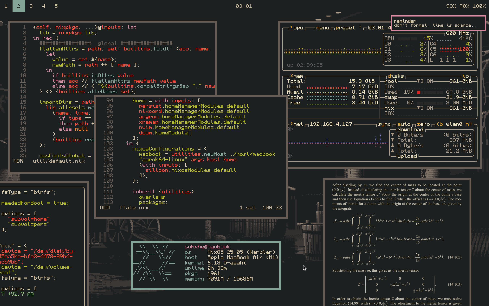

## preview

## about
its a minimalistic, simply structured, impermanent nixos config

### tool
| action       | combination     |
| ------------ | --------------- |
| btooth ui    | cmd b           |
| wifi ui      | cmd v           |
| vpn ui       | cmd shift v     |
| browser      | cmd w           |
| launcher     | cmd space       |
| terminal     | cmd enter       |
| file manager | cmd shift enter |
### view
| action       | combination      |
| ------------ | ---------------- |
| pick color   | cmd p            |
| copy screen  | cmd s            |
| save screen  | cmd ctrl s       |
| copy area    | cmd shift s      |
| save area    | cmd ctrl shift s |
### window
| action        | combination     |
| ------------- | --------------- |
| fullscreen    | cmd f           |
| floating      | cmd shift f     |
| close app     | cmd q           |
| focus [arrow] | cmd [arrow]     |
| move to [0-9] | cmd shift [0-9] |
| move to empty | cmd shift e     |
### action
| action           | combination      |
| ---------------- | ---------------- |
| wipe cboard      | cmd shift c      |
| close sess       | cmd ctrl shift q |
| switch to [0-9]  | cmd [0-9]        |
